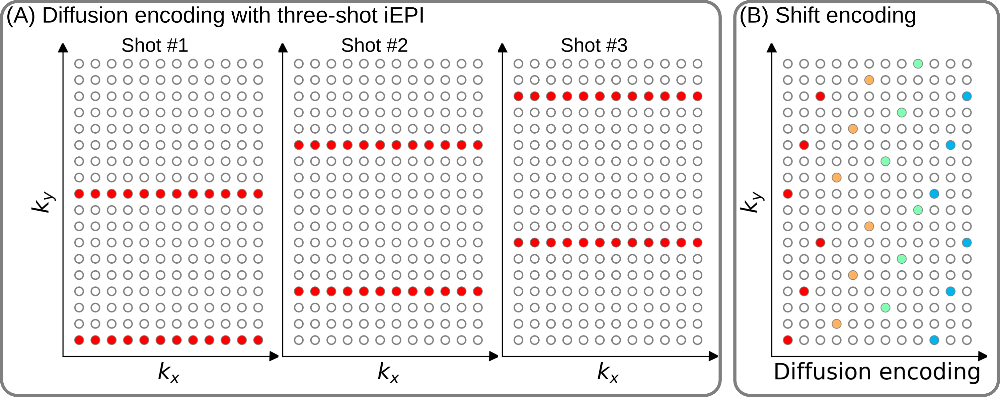
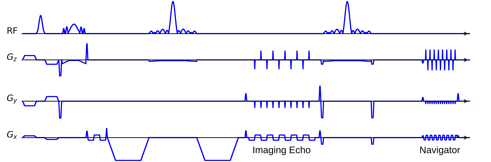
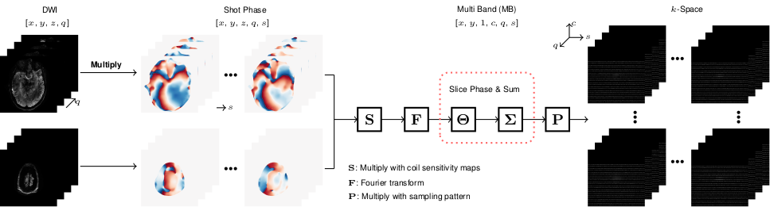

# JETS for Diffusion MRI at 7 T

Demonstration on Joint k-q-slice rEconsTruction framework for Shift-encoded (JETS) Diffusion MRI at 7 T

## Pulse Sequence

### Complementary k-q-space sampling



**Figure 1**. **(A)** An example diffusion-weighted magnetic resonance imaging (DWI, or DW-MRI) acquisition based on three-shot interleaved echo-planar imaging (iEPI). **(B)** The proposed shift encoding scheme. Given the use of three-shot iEPI, every three columns have the same color, representing one DWI acquisition. The subsequent DWI acquisition is shifted by one $k_y$ line to create complementary k-q-space sampling pattern.

### NAViEPI



**Figure 2**. Navigator-based iEPI with **consistent effective echo spacing** between the imaging and the navigator echo - where iEPI meets readout-segmented EPI (rsEPI). This enables (1) minimal distortion mismatch between imaging and navigator echoes, (2) reliable shot-to-shot phase variation estimation, and (3) flexible number of shots.


## Joint k-q-Slice Reconstruction

### Forward modeling



**Figure 3**. An illustration of the formation of the forward operator in our joint k-q-slice reconstruction.
The indices 'x' and 'y' denote the image size, 'z' denotes the multi-band slices, 'q' denotes the diffusion encoding, 's' denotes the shots, and 'c' denotes the coil sensitivities.

### Iterative reconstruction

With the above forward model, the reconstruction jointly and iteratively solves for multi-band and multi-diffusion-direction images.

## Download Data

[](https://doi.org/10.5281/zenodo.10474402)

You can either manually download them on [Zenodo](https://doi.org/10.5281/zenodo.10474402) or execute the following commands in a `bash` terminal:

```bash
cd data
python load.py
```

## Interactive Code Demonstration

* JETS reconstruction: [](https://colab.research.google.com/github/ZhengguoTan/NAViEPI/blob/main/demo_jets_diffusion_mri_7t_llr.ipynb)

* LLR regularization: [](https://colab.research.google.com/github/ZhengguoTan/NAViEPI/blob/main/demo_llr.ipynb)

* Single-Shot Multi-Band EPI SENSE reconstruction: [](https://colab.research.google.com/github/ZhengguoTan/NAViEPI/blob/main/demo_ssh_epi_recon.ipynb)


## References

If you find the open-source codes/data useful, please cite:

```bibtex
@Article{tan_2024_diff7t,
    Title     = {{Accelerated Diffusion Weighted Magnetic Resonance Imaging at 7 T: Joint Reconstruction for Shift-Encoded Navigator-based Interleaved Echo Planar Imaging (JETS-NAViEPI)}},
    Author    = {Tan, Zhengguo and Liebig, Patrick A and Heidemann, Robin M and Laun, Frederik B and Knoll, Florian},
    Journal   = {Imaging Neuroscience},
    Year      = {2024},
    Volume    = {2},
    Pages     = {1-15},
    doi       = {10.1162/imag_a_00085}
}
```