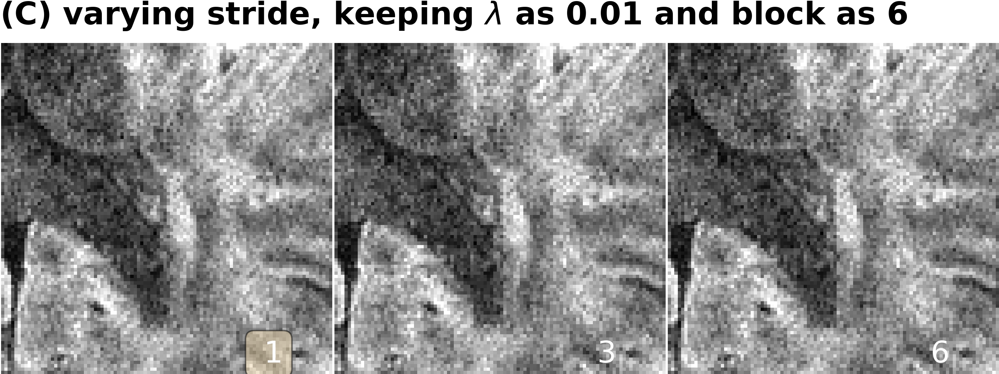

# The folder creates the ablation experiment figures

* **data**: 5shot_3trace_0.5mm

### run the reconstruction

```bash
python reco.py
```

### plot figures

```bash
python plot.py
```

<p align="center">
  
  
  
</p>
