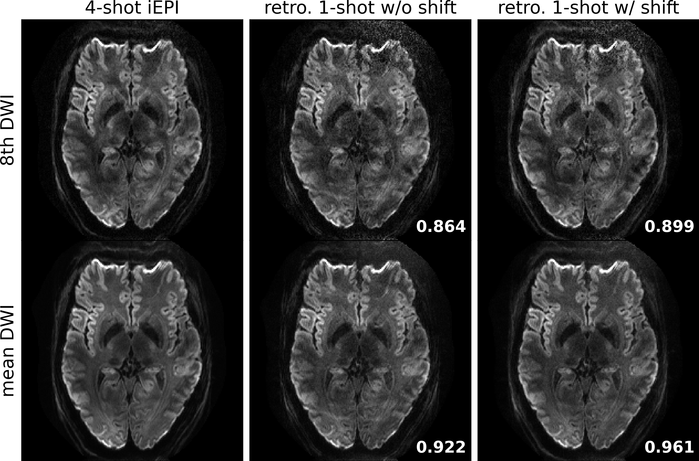

# The folder creates the ground-truth experiment figures

* **data**: 4shot_020dir_1.0mm
* **experiment**: retrospectively undersampled the 4-shot data to only 1 shot

### run the reconstruction

```bash
python retro.py
```

### plot figures

```bash
python plot.py
```

<p align="center">
  
</p>
