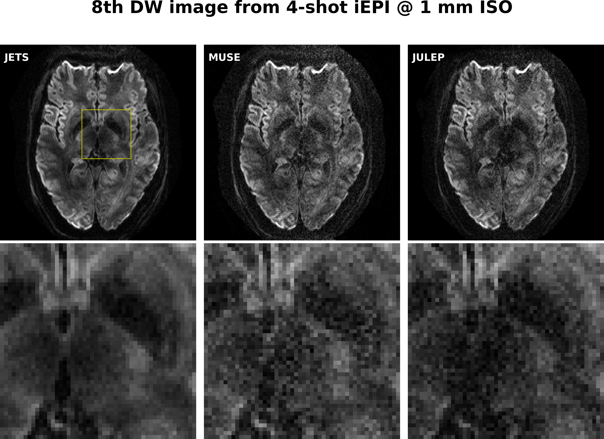

# The folder creates the figure comparing different reconstruction methods

* **data**: 1.0mm_20-dir_R1x3

### JULEP

* JULEP paper: https://doi.org/10.1002/mrm.29422
* JULEP code: https://github.com/daiep/JULEP

##### step 1. run the preparation script:

```bash
python julep_prep.py
```

##### step 2.

* copy the scripts `julep_main_7t.m` and `muse_main_7t.m` to `/JULEP/`;
* run the two scripts in MATLAB.

##### step 3. run the JETS recon:

```bash
python jets.py
```

##### step 3. run the plot script:

```bash
python plot.py
```

<p align="center">
  
</p>
