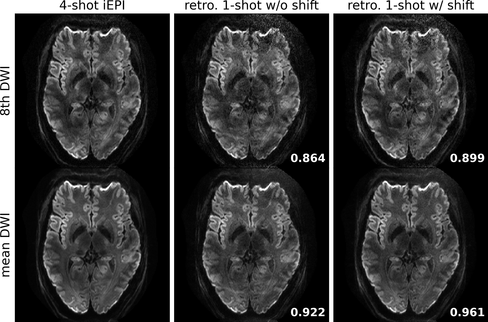

# The folder creates the ground-truth experiment figures

* **data**: 1.0mm_20-dir_R1x3
* **experiment**: retrospectively undersample the 4-shot data to only 1 shot, and then perform JETS reconstruction

### run the reconstruction

```bash
python retro.py
```

### plot figures

```bash
python plot.py
```

<p align="center">
  
</p>
