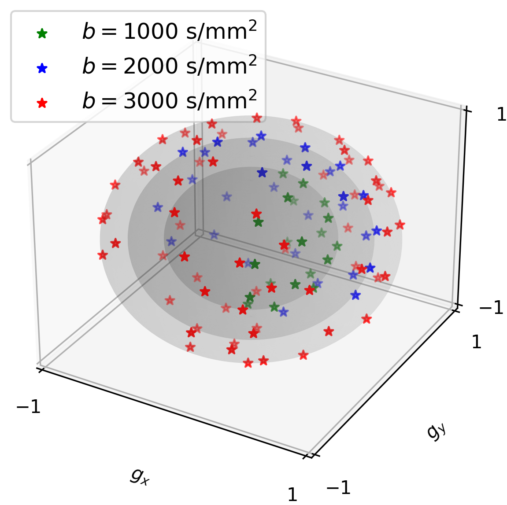

# The folder creates sampling patterns

### plot 2-shot kx-ky sampling pattern

```bash
python plot_sample_pattern.py --plot_kxky --seg_idx 1
python plot_sample_pattern.py --plot_kxky --seg_idx 2
```

<p align="center">
  
&nbsp; &nbsp; &nbsp; &nbsp;
  
</p>

### plot 2-shot ky-diff sampling pattern

```bash
python plot_sample_pattern.py
```

<p align="center">
  
</p>


### plot 1-shot ky-diff sampling pattern

```bash
python plot_sample_pattern.py --seg 1
```

<p align="center">
  
</p>

### plot multi-shell sampling spheres

```bash
python plot_sphere.py
```

<p align="center">
  
</p>

### Locally Low Rank

```bash
python demo_llr.py
```

<p align="center">
  
&nbsp; &nbsp; &nbsp; &nbsp;
  
</p>